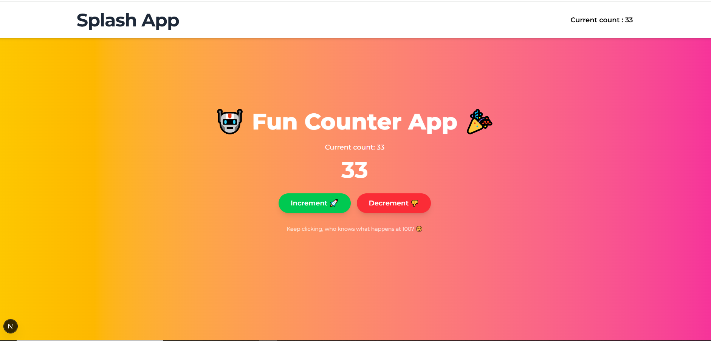

# Context API Global State Counter App

This project demonstrates how to use **React Context API** to manage global state across multiple components without prop drilling. It extends the base structure of `alx-project-0x04` and introduces shared state between the `Header` and `CounterApp` components.

---

## 📚 Table of Contents

- [Screenshots](#screenshots)
- [Tech Stack](#tech-stack)
- [Project Structure](#project-structure)
- [Objective](#objective)
- [Installation](#installation)
- [Implementation](#implementation)
- [Credits](#credits)
- [Contact](#contact)

---

## Screenshots



---

## Tech Stack


---

## Project Structure

```plaintext
alx-project-0x05/
├── components/
│ ├── layouts/
│ │ └── Header.tsx
├── context/
│ └── CountContext.tsx
├── pages/
│ ├── _app.tsx
│ ├── index.tsx
│ └── counter-app.tsx
├── styles/
│ └── globals.css
├── public/
├── package.json
├── README.md
└── ...
```

---

## Installation

1. **Clone the repository**

   ```bash
   git clone https://github.com/mia06-coder/alx-project-0x04-setup.git
   cd alx-project-0x05
   ```

2. Install dependencies

   ```bash
   npm install
   ```

3. Run the development server
   ```bash
   npm run dev -- -p 3000
   ```

---

## Objective

The **Context API** allows us to maintain a global state that can be accessed and modified across components without needing to pass props manually at every level.

In this app:

- A counter state is declared globally.
- The `Header` and `CounterApp` components both consume and reflect changes in this global state.
- When the counter is incremented or decremented in one component, the change is reflected in the other.

---

## Implementation

1. **Create Context Provider**: `context/CountContext.tsx` contains the global counter logic
2. **Wrap Application in Provider** in `pages/_app.tsx`
3. **Update Header to Reflect Global State** in `components/layouts/Header.tsx`

---

## Credits

- Project idea & structure inspired by [ALX](https://www.alxafrica.com/) exercises
- Icons and badges from [Shields.io](https://shields.io/)

---

## Contact

Made with ❤️ by **Mia Mudzingwa**

- GitHub: [Mia06-coder](https://github.com/Mia06-coder)
- LinkedIn: [mia-mudzingwa](https://www.linkedin.com/in/mia-mudzingwa)
