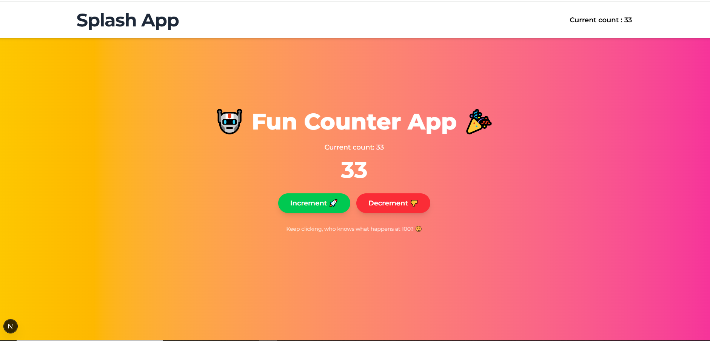

# Global State Counter App with Redux

This project enhances the previous versions by integrating **Redux Toolkit** for robust, scalable global state management. Using Redux, this version manages a shared counter value accessible in both the `Header` and `CounterApp` components—demonstrating real-time global state updates across unrelated components.

---

## 📚 Table of Contents

- [Screenshots](#screenshots)
- [Tech Stack](#tech-stack)
- [Project Structure](#project-structure)
- [Objective](#objective)
- [Installation](#installation)
- [Implementation](#implementation)
- [Credits](#credits)
- [Contact](#contact)

---

## Screenshots



---

## Tech Stack


---

## Project Structure

```plaintext
alx-project-0x05/
├── components/
│ ├── layouts/
│ │ └── Header.tsx
├── context/
│ └── CountContext.tsx
├── pages/
│ ├── _app.tsx
│ ├── index.tsx
│ └── counter-app.tsx
├── store/
│ └── store.ts
├── styles/
│ └── globals.css
├── public/
├── package.json
├── README.md
└── ...
```

---

## Installation

1. **Clone the repository**

   ```bash
   git clone https://github.com/mia06-coder/alx-project-0x04-setup.git
   cd alx-project-0x06
   ```

2. Install dependencies

   ```bash
   npm install
   ```

3. Run the development server
   ```bash
   npm run dev -- -p 3000
   ```

---

## Objective

Redux allows us to manage a **centralized state** that multiple components can access and modify—perfect for large-scale applications.

In this app:

- The counter state is stored in a **Redux slice**.
- Components like `Header` and `CounterApp` **subscribe** to the state using `useSelector`.
- State is modified using **dispatch** functions for `increment` and `decrement`.
- This eliminates **prop drilling** and supports easy **scaling**.

---

## Implementation

1. Configure Redux Store in `store/store.ts`
2. Wrap App in Provider in `pages/_app.tsx`
3. Counter App with Dispatch Logic in `pages/counter-app.tsx`
4. Shared State in Header in `components/layouts/Header.tsx`

---

## Credits

- Project idea & structure inspired by [ALX](https://www.alxafrica.com/) exercises
- Icons and badges from [Shields.io](https://shields.io/)

---

## Contact

Made with ❤️ by **Mia Mudzingwa**

- GitHub: [Mia06-coder](https://github.com/Mia06-coder)
- LinkedIn: [mia-mudzingwa](https://www.linkedin.com/in/mia-mudzingwa)
